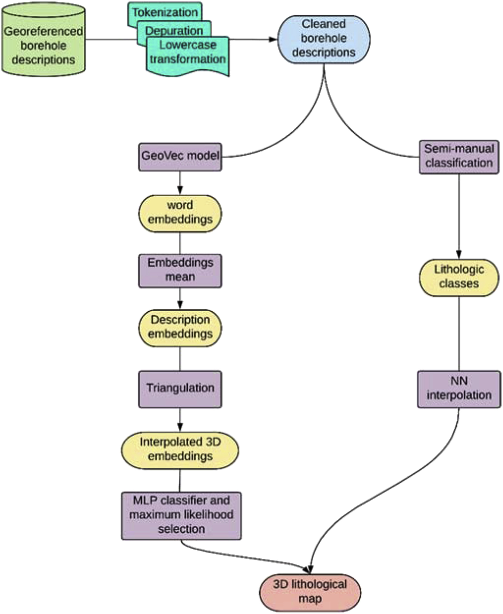
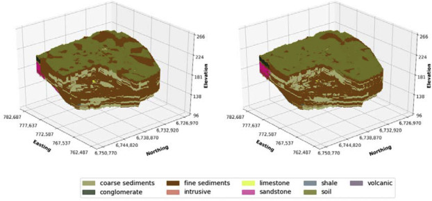
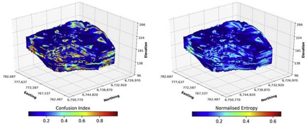

# GeoVectoLitho

Code associated with the open access publication entitled [3D lithological mapping of borehole descriptions using word embeddings](https://www.sciencedirect.com/science/article/pii/S0098300419306533) in **Computers & Geosciences** by Ignacio Fuentes, José Padarian, Takuya Iwanaga, and R. Willem Vervoort from The University of Sydney and the Australian National University


**doi**: https://doi.org/10.1016/j.cageo.2020.104516


## About

The Scripts correspond to python scripts that can be used as examples to create lithological maps.

<p align="center">
  
</p>

These can be calculated from hydrometeorological gridded data stored in GEE, including CHIRPS for rainfall, a combination of variables to calculate evapotranspiration from ERA5 and FLDAS, NDVI from AVHRR and MODIS, and runoff from ERA5. However, other datasets can also be used. Trends and average drought characteristic functions can be found in the gamma distribution file, and may be applied to other distribution/indices after slight modifications. 

<p align="center">
  
</p>

<p align="center">
  
</p>

## How to cite this work?

### Article

```
@article{fuentes20203d,
  title={3D lithological mapping of borehole descriptions using word embeddings},
  author={Fuentes, Ignacio and Padarian, Jos{\'e} and Iwanaga, Takuya and Vervoort, R Willem},
  journal={Computers \& Geosciences},
  volume={141},
  year={2020},
  publisher={Elsevier}
}
```

